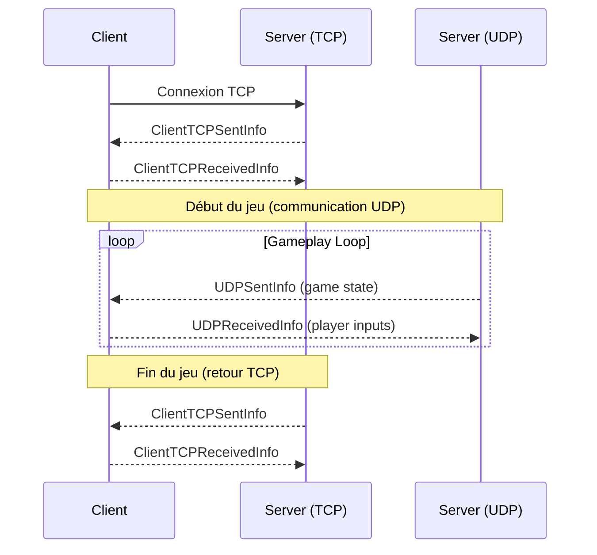

# R-Type Network Protocol Documentation

## Overview

The R-Type network protocol implements a hybrid TCP/UDP communication model designed for multiplayer gaming. TCP is used for reliable connection establishment and game state transitions, while UDP handles real-time gameplay data with minimal latency.

## Protocol Architecture

The protocol follows a three-phase communication pattern:

1. **Connection Phase (TCP)**: Initial handshake and player registration
2. **Gameplay Phase (UDP)**: Real-time game state synchronization and player input transmission
3. **Termination Phase (TCP)**: Session cleanup and final score transmission

In parallel, the TCP connection is used for asynchronous communication, such as the chat system.

## Communication Flow



## Data Structures

All network data types are defined in the `network` namespace with a buffer size constraint of 64 bytes (`BUFFERSIZE = 64`).

### ConnectionInfo

Used internally to manage connection metadata.

```cpp
struct ConnectionInfo {
    std::string ip;        // Client IP address
    uint16_t port;         // Connection port
    std::string uuid;      // Auto-generated unique identifier
}
```

**Purpose**: Stores connection parameters and generates a unique UUID for each client session.

### ClientTCPReceivedInfo

Data structure sent **from client to server** via TCP.

```cpp
struct ClientTCPReceivedInfo {
    bool ready;                    // Player ready status
    char userPass[BUFFERSIZE];     // User password/identifier
    char uuid[BUFFERSIZE];         // Client UUID
    uint16_t portUDP;              // UDP port for gameplay
}
```

**Usage**: 
- Initial connection: Client sends its UUID and UDP port for game communication
- Session end: Client confirms readiness state and maintains session identification

### ClientTCPSentInfo

Data structure sent **from server to client** via TCP.

```cpp
struct ClientTCPSentInfo {
    char userID[BUFFERSIZE];       // Player identifier
    uint16_t portUDP;              // Server UDP port
    uint16_t score;                // Current player score
}
```

**Usage**:
- Connection acknowledgment: Server assigns user ID and communicates UDP port
- Game termination: Server sends final score to client

### UDPReceivedInfo

Data structure sent **from client to server** via UDP during gameplay.

```cpp
struct UDPReceivedInfo {
    unsigned inputIndex = 0;       // Input sequence number
    char uuid[BUFFERSIZE];         // Client UUID for identification
    component::PlayerInput game;   // Player input actions
}
```

**Purpose**: Transmits player inputs (movement, shooting, etc.) with client identification for multiplayer synchronization.

### UDPSentInfo

Data structure sent **from server to client** via UDP during gameplay.

```cpp
struct UDPSentInfo {
    std::string serializedData;    // Serialized game state
}
```

**Purpose**: Contains the complete serialized game state for client-side reconciliation and rendering. This includes entity positions, health, projectiles, and other game objects.

## Protocol Phases

### Phase 1: TCP Connection Establishment

1. **Client initiates TCP connection** to server
2. **Server responds** with `ClientTCPSentInfo`:
   - Assigns unique `userID`
   - Provides `portUDP` for game communication
   - Initializes `score` to 0
3. **Client confirms** with `ClientTCPReceivedInfo`:
   - Sends back its `uuid`
   - Confirms `portUDP` for UDP communication
   - Sets `ready` status

### Phase 2: UDP Gameplay Loop

Once TCP handshake completes, the game transitions to UDP for performance:

- **Server → Client**: Continuously sends `UDPSentInfo` containing serialized game state
  - Include entities and components networkables
  
- **Client → Server**: Sends `UDPReceivedInfo` with player inputs every time during the game
  - Contains movement commands, actions
  - Includes `uuid` for player identification
  - Includes inputIndex for packet sequencing.
  - Sent every input change

This bidirectional UDP communication enables real-time gameplay with minimal latency.

### Phase 3: TCP Session Termination

When the game ends:

1. **Server sends** final `ClientTCPSentInfo` with:
   - Final `score`

### UUID Management

Each client receives a unique generated UUID. This identifier:
- Persists across the entire session
- Enables multiplayer client distinction in UDP packets
- Links TCP and UDP communications for the same client

### Auxiliary Protocol: Chat (TCP)

The chat system operates in parallel to the gameplay loop, using the established TCP connection.

    Client → Server: To send a message, the client sends a packet prefixed with PacketType::ChatSend, followed by the ClientSendMessage structure.

    Server → Client: When the server receives a message, it processes it (e.g., prepending the player's name) and broadcasts it to all connected clients. It sends a packet prefixed with PacketType::ChatReceive, followed by the ClientReceiveMessage structure.

This communication can happen at any point after Phase 1 (Connection) and before Phase 3 (Termination).

UUID Management

Each client receives a unique generated UUID. This identifier:

    Persists across the entire session.

    Enables multiplayer client distinction in UDP packets.

    Links TCP and UDP communications for the same client.
